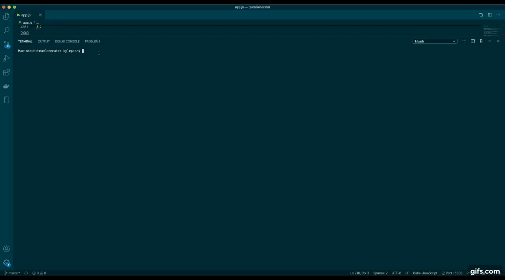
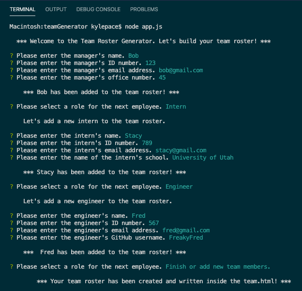
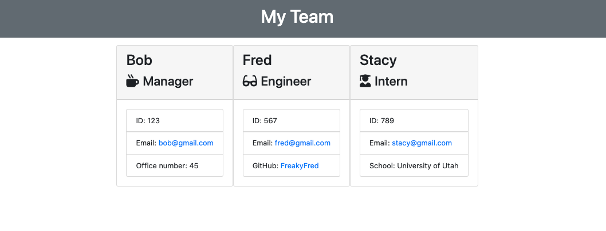

  # Employee Roster Generator  
  ##    
  ## Description  
  A Node.js CLI application that asks the user a series of questions to dynamically create an HTML file that displays a summary of information for each member of a team.   
  ## Installation  
  Navigate to the directory via your computer's terminal and enter "git clone git@github.com:killerkyle/teamGenerator.git". Then enter "npm i" to install the required node modules.  
  ## Usage  
  Go to the "teamGenerator" directory using the computer's terminal and enter "node app.js". This will create a series of questions and create a team.html file in the teamGenerators output folder that you have already created and after answering the pertaining questions inside of the terminal.  
  ## License  
  This project is licensed under the MIT license.    
  ## Tests  
  This project was created using a test driven development. Enter insdie the computers terminal "npm test" in the teamGenerator directory to see that the application passes a total of 17 tests across 4 test suites which can be reviewed in the test subdirectory.  
  ## Videos  
      
  ## Screenshots  
    
    
  ## Questions  
  Please contact me with any questions at:  
  GitHub: [killerkyle](https://github.com/killerkyle)  
  Email: [kylelpace@gmail.com](mailto:kylelpace@gmail.com)
  